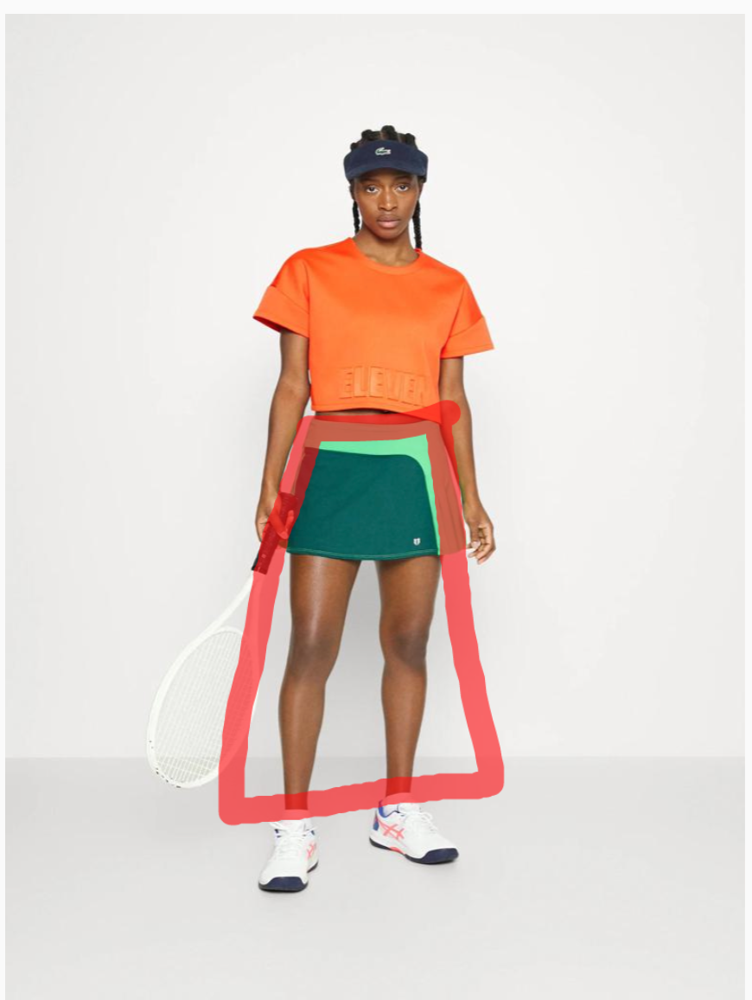
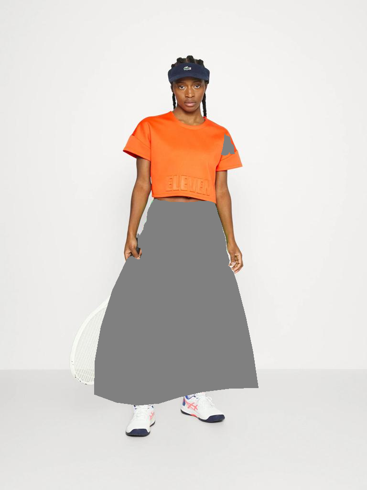
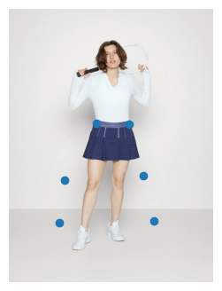
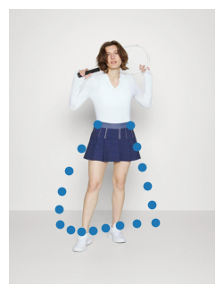
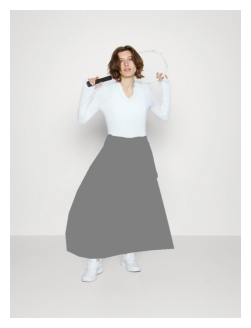

# shaded_segmentation

The task was is to obtain shaded segmentation of area of 'big skirt'. Examples are presented in `./guidelines_of_first_20_images`.

<div>


</div>

## Downloading data
For downloading dataset and guideline images:

```bash
./scripts/download_data.sh 
```

For downloading result images:

```bash
./scripts/download_results.sh 
```

## Algorithm

There are 2 classes: `DataExtractor`, `MaskGenerator`. `DataExtractor` extracts segmentation masks of parts of body.
`MaskGenerator` contains all methods for generation of mask.

### 1. Custom dataset

Using images from `./guidelines_of_first_20_images` I collected `custom_pose.json` that contains coordinates of 6 boundary points of 'big skirt'.

### 2. Linear Regression

Using custom dataset (`custom_pose.json`) and pose coordinates for every image (`./dataset/pose_json`) I fitted Linear Regression that predicts 6 boundary points of skirt.



### 3. Smoothing 'skirt'

Polytope (span) of these 6 points would be too angular, so we smooth it usings quadratic splines (we add more points).



### 4. Creating mask

We connect the points sequentially and obtain mask. After that we correct it using segmentation masks extracted from 
`./dataset/human_parsing`



## Further steps

Results are depend from segmentation from dataset (`./dataset/human_parsing`) and pose coordinates (`./dataset/pose_json`). There is inaccuracy in this data. 
The further steps are:

* To consider in detail cases when some pose coordinates are missing (ankles, etc.)

* To consider inaccuracy in segmentation masks 